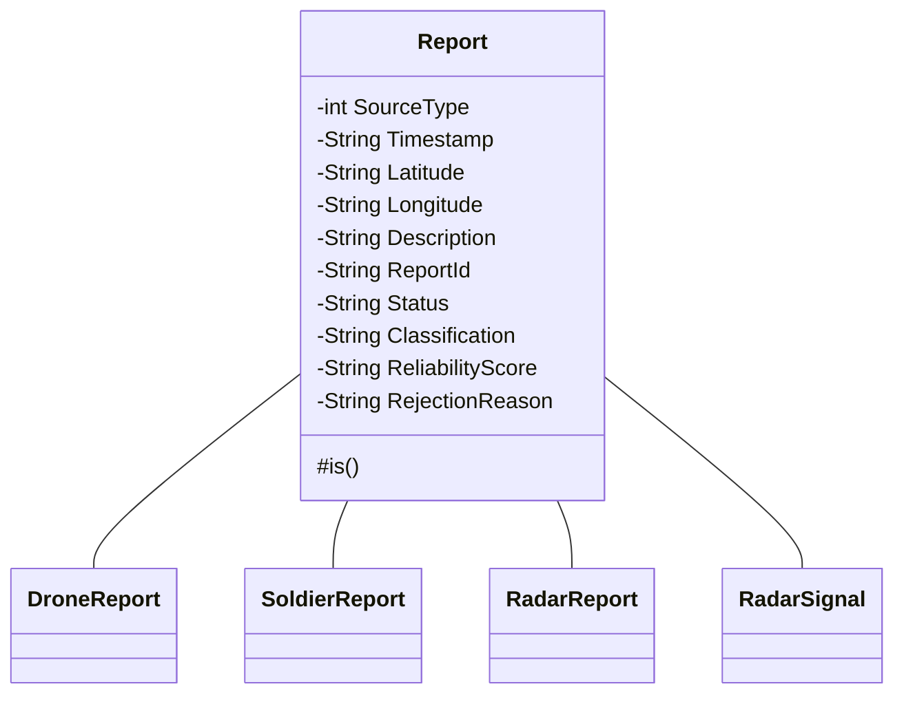

```mermaid

classDiagram
direction TB
    class Report {
	    -int SourceType
	    -String Timestamp
	    -String Latitude
	    -String Longitude
	    -String Description
	    -String ReportId
	    -String Status
	    -String Classification
	    -String ReliabilityScore
	    -String RejectionReason
	    #is()
    }

    class DroneReport {

    }

    class SoldierReport {

    }

    class RadarReport {

    }

    class RadarSignal {

    }

    Report -- DroneReport
    Report -- SoldierReport
    Report -- RadarReport
    Report -- RadarSignal

```